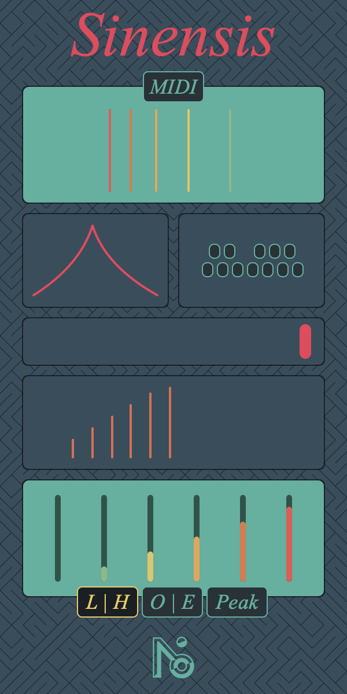

# Sinensis

Sinensis is an audio plugin.

### Stack : 
Cmake - Ninja - LLVM - LLDB

### Info and download :
[Siensis web page](https://lndf.fr/NOI/Sinensis.html)

### Font : 
Times New Roman - Italic

### Color Palette : 
-  `#FFEF3D59`
-  `#FFE17A47`
-  `#FFEFC958`
-  `#FF4AB19D`
-  `#FF344E5C`

[More info to build it yourself](https://github.com/LeNomDesFleurs/HELLEBORE_JUCE/wiki/Building)
